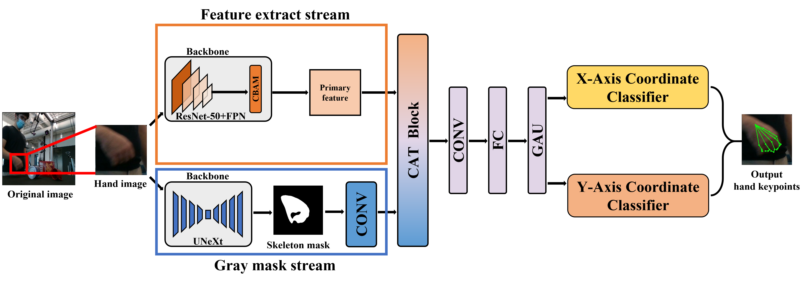

# Two-Stream Hand Pose Estimation for Occluded Hands
## Introduction
This repository is the offical [Pytorch](https://pytorch.org/) implementation of **Two-Stream Hand Pose Estimation for Occluded Hands**. Below is the overall pipeline of Two-Stream-HPEOH.


## Directory
### Environment
You can refer to the following three github:
* [HandOccNet](https://github.com/namepllet/HandOccNet)
* [UNeXt](https://github.com/jeya-maria-jose/UNeXt-pytorch)
* [MMPose](https://mmpose.readthedocs.io/en/latest/installation.html)

### Root  
The `${ROOT}` is described as below.  
```  
${ROOT}  
|-- data  
|-- demo
|-- common  
|-- main  
|-- output  
```  
* `data` contains data loading codes and soft links to images and annotations directories.  
* `demo` contains demo codes.
* `common` contains kernel codes for HandOccNet.  
* `main` contains high-level codes for training or testing the network.  
* `output` contains log, trained models, visualized outputs, and test result.  

### Data  
You need to follow directory structure of the `data` as below.  
```  
${ROOT}  
|-- data  
|   |-- HO3D
|   |   |-- train
|   |   |   |-- ABF10
|   |   |   |-- ......
|   |   |-- evaluation
|   |   |-- annotations
|   |   |   |-- HO3D_train_data.json
|   |   |   |-- HO3D_evaluation_data.json
|   |-- DEX_YCB
|   |   |-- 20200709-subject-01
|   |   |-- ......
|   |   |-- annotations
|   |   |   |--DEX_YCB_s0_train_data.json
|   |   |   |--DEX_YCB_s0_test_data.json
``` 
* Download HO3D(version 2) data and annotation files [[data](https://www.tugraz.at/institute/icg/research/team-lepetit/research-projects/hand-object-3d-pose-annotation/)][[annotation files](https://drive.google.com/drive/folders/1pmRpgv38PXvlLOODtoxpTYnIpYTkNV6b?usp=sharing)]
* Download DexYCB data and annotation files [[data](https://dex-ycb.github.io/)][[annotation files](https://drive.google.com/drive/folders/1pmRpgv38PXvlLOODtoxpTYnIpYTkNV6b?usp=sharing)] 

### Output  
You need to follow the directory structure of the `output` folder as below.  
```  
${ROOT}  
|-- output  
|   |-- log  
|   |-- model_dump  
|   |-- result  
|   |-- vis  
```  
* Creating `output` folder as soft link form is recommended instead of folder form because it would take large storage capacity.  
* `log` folder contains training log file.  
* `model_dump` folder contains saved checkpoints for each epoch.  
* `result` folder contains final estimation files generated in the testing stage.  
* `vis` folder contains visualized results.

### Quick demo
* if you want to use config backbone `fpn`
* Run FPN_main.py
* if you want to use config backbone `unext`
* Run UX_HON_main.py
